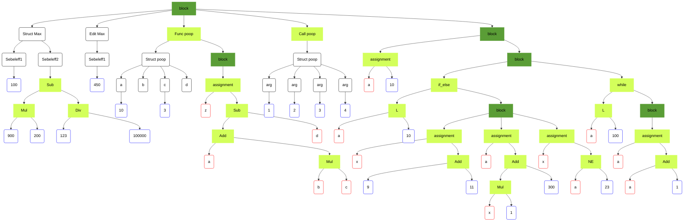

# ParaCL

## Example

```c
{
    struct Max
    {
        Sebeleff1 = 100,
        Sebeleff2 = 900 * 200 - 123 / 100000
    }

    Max.Sebeleff1 = 450

    func poop(a = 10, b, c = 3, d)
    {
        z = a + b * c - d
    }

    poop(1, 2, 3, 4)

    {
        a = 10
        {
            if (a < 10)
            {
                x = 9 + 11
                a = x * 1 + 300
                x = a != 23
            }
            while (a < 100)
            {
                a = a + 1
            }
        }
    }


}
```




For contributors, or to find out how everything works behind the scenes, see: [ABOUT.md](ABOUT.md)
